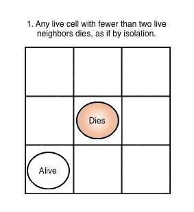
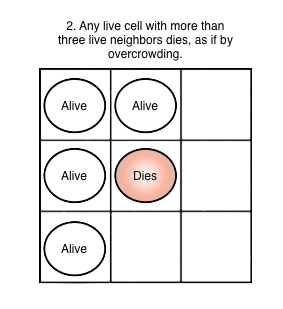
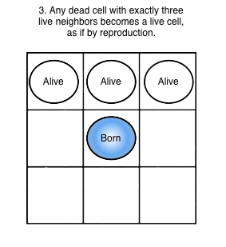

# Conway's Game of Life
Python implementation of the Conway's Game of Life using PyQt5.

## Game of Life
The Game of Life is a grid sistem composed by cells which can assume a finite number of states. The state of each cell is determined by a set of rules applied to cells and their neighborhood.
t was devised by the British matematician John Horton Conway in 1970 as a simplification of the John von Neumann original idea to realize a cellular automaton that simulated a Turing machine.
For further info check the [Wikipedia](https://en.wikipedia.org/wiki/Conway%27s_Game_of_Life) page.

## Rules
The original Conway's Game of Life is defined over a infinite grid of cells with only two states: alive or dead.
At each timestep the grid states is updated applying the following rules:








## Implementation


### Graphical User Interface

### Features
- Start and Pause the simulation
- Control the simulation speed via a slider
- Perform a single step of the simulation
- Show the cell age.
Besides the classical black and white representation of alive and dead cells, they can be colored according to their age
- Show the age of the "Game Time" (i.e. for how long the simulation is going)
- Show the number of alive cells
- The grid is editable when the simulation is paused
- Click and Drag for an easy way to change the cells state
- Reset the grid to the initial state (blank if no pattern is selected)
- Custom pattern can be saved and loaded
- Pattern can also be loaded from [here](https://conwaylife.com/wiki/Category:Patterns).
Right now just the [plaintext format](https://www.conwaylife.com/wiki/Plaintext) is supported
- Fixed sized grid.
The grid size can be edited using the [config.yml](./config.yml) file
- Provide information of the game commands and rules
- Provide general information about the game

### Requirements
The dependencies can be install with the following command:
```
conda env create -f conda_env.yml
```

| Software   | Version           |
| -----------|-------------------|
| **Python** | tested on v3.6    | 
| **PyQT5**  | tested on v5.9.2  |
| **Numpy**  | tested on v1.17.0 |
| **PyYaml** | tested on v5.4.1  |


## Play the game
In order to start the game it's just needed to run [main.py](./main.py) file. For changing some settings (e.g. grid size or the game grid loaded by default) you can edit the [config.yml](./config.yml) file.
